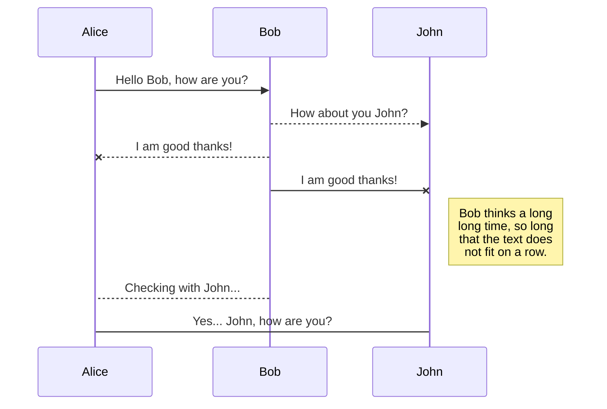
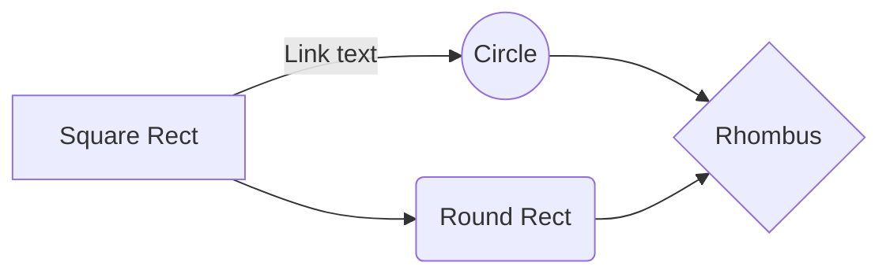

<p align="center"><a href="https://laravel.com" target="_blank"></a></p>

# IMPOSTARE LARAVEL + VUE + VUETIFY

#### https://www.youtube.com/watch?v=VaI9tV8GQFk

```
laravel new lara-vue-vuetify-1
cd lara-vue-vuetify-1
```

https://github.com/laravel/ui
```
composer require laravel/ui --dev
php artisan ui vue --auth
```

```
npm install && npm run dev
npm install vue-loader@^15.9.5 --save-dev --legacy-peer-deps
```
(forse l'ultimo comando lo fa da solo)


#### Vuetify -> Webpack install
https://vuetifyjs.com/en/getting-started/installation/#webpack-install
```
npm install vuetify
npm install sass sass-loader deepmerge -D
```

https://vuetifyjs.com/en/features/treeshaking/#vuetify-loader
```
npm install vuetify-loader
```


CREA resources/js/plugins/vuetify.js E SCRIVICI
```
// You still need to register Vuetify itself
// src/plugins/vuetify.js

import Vue from 'vue'
import Vuetify from 'vuetify/lib'

Vue.use(Vuetify)

const opts = {}

export default new Vuetify(opts)
```


pacchetto facoltativo ma aiuta
```
npm install --save-dev case-sensitive-paths-webpack-plugin
```


APRI **webpack.mix.js** E INCOLLA DOPO LA PRIMA RIGA:
```
//recupero i due pacchetti installati
const VuetifyLoaderPlugin = require('vuetify-loader/lib/plugin');
const CaseSensitivePathsPlugin = require('case-sensitive-paths-webpack-plugin');

//li metto in un oggetto con un array di plugins
var webpackConfig = {
    plugins: [
        new VuetifyLoaderPlugin(),
        new CaseSensitivePathsPlugin()
        // other plugins ...
    ]
    // other webpack config ...
}

//infine li metto nell'oggetto mix
mix.webpackConfig( webpackConfig );
```

NEL FILE **resources/js/app.js** DOPO LA RIGA
```
window.Vue = require('vue').default;
```
AGGIUNGERE
```
import Vuetify from "../js/plugins/vuetify";
E ALLA FINE AGGIUNGERE
const app = new Vue({
    vuetify: Vuetify,
    el: '#app',
});
```

```
npm run watch
```
PER TESTARLO VADO IN http://127.0.0.1:8000/login


PER TESTARE SE FUNGE VUE AGGIUNGO DENTRO ```div#app``` NEL FILE **resources/views/layouts/app.blade.php**
```
<example-component></example-component>
```

PER TESTARE SE FUNGE VUETIFY SCRIVO DENTRO **resources/js/components/ExampleComponent.vue**
```
    <v-app>
        <v-btn small color="primary">Button di vuetify</v-btn>
    </v-app>
```


# SPA APPLICATION:
#### AGGIUNGERE ANCHE QUESTE COSE
#### https://www.youtube.com/watch?v=cXGxO6KCR4g


- Facoltativamente ho aggiunto il campo (required) ```Lastname``` in registrazione: in **user_migration**, in **register.blade**, in **User.model**, in **RegisterController**

```
php artisan migrate
```

- COPIO **resources/views/layouts/app.blade.php** IN **resources/views/spa.blade.php**

- IN **HomeController** DA ORA REINDIRIZZO SU view('spa') APPENA CREATA

- IN **resources/views/spa.blade.php** POSSO COPIARE UNO DI QUESTI LAYOUT DI VUETIFY COME COMPONENT

    - https://vuetifyjs.com/en/getting-started/wireframes/#examples

- AGGIUNGO IL COMPONENT IN **app.js**


# Synchronization

Synchronization is one of the biggest features of StackEdit. It enables you to synchronize any file in your workspace with other files stored in your **Google Drive**, your **Dropbox** and your **GitHub** accounts. This allows you to keep writing on other devices, collaborate with people you share the file with, integrate easily into your workflow... The synchronization mechanism takes place every minute in the background, downloading, merging, and uploading file modifications.

There are two types of synchronization and they can complement each other:

- The workspace synchronization will sync all your files, folders and settings automatically. This will allow you to fetch your workspace on any other device.
  > To start syncing your workspace, just sign in with Google in the menu.

- The file synchronization will keep one file of the workspace synced with one or multiple files in **Google Drive**, **Dropbox** or **GitHub**.
  > Before starting to sync files, you must link an account in the **Synchronize** sub-menu.


## SmartyPants

SmartyPants converts ASCII punctuation characters into "smart" typographic punctuation HTML entities. For example:

|                |ASCII                          |HTML                         |
|----------------|-------------------------------|-----------------------------|
|Single backticks|`'Isn't this fun?'`            |'Isn't this fun?'            |
|Quotes          |`"Isn't this fun?"`            |"Isn't this fun?"            |
|Dashes          |`-- is en-dash, --- is em-dash`|-- is en-dash, --- is em-dash|


## KaTeX

You can render LaTeX mathematical expressions using [KaTeX](https://khan.github.io/KaTeX/):

The *Gamma function* satisfying $\Gamma(n) = (n-1)!\quad\forall n\in\mathbb N$ is via the Euler integral

$$
\Gamma(z) = \int_0^\infty t^{z-1}e^{-t}dt\,.
$$

> You can find more information about **LaTeX** mathematical expressions [here](http://meta.math.stackexchange.com/questions/5020/mathjax-basic-tutorial-and-quick-reference).


## UML diagrams

You can render UML diagrams using [Mermaid](https://mermaidjs.github.io/). For example, this will produce a sequence diagram:



And this will produce a flow chart:



